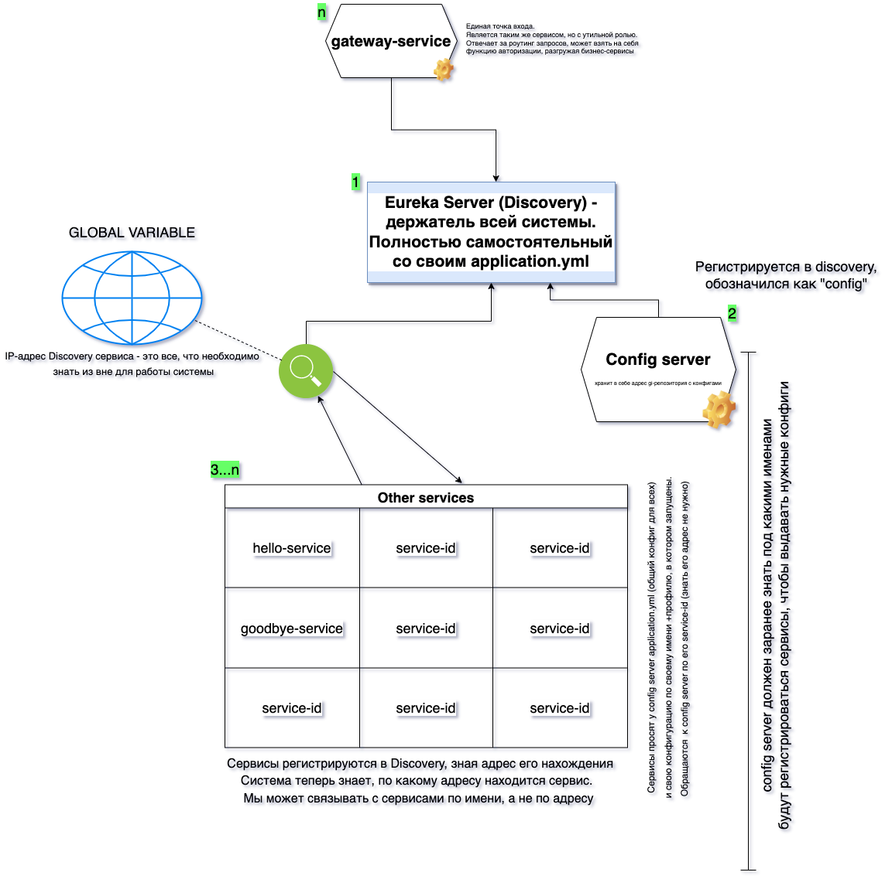

# spring-cloud-example
Базируется на Eureka Server (Service Discovery), 
Config Server (git repository), Gateway

P.S.: в дальнейшем будет ссылка на актуальную схему проекта
___

### 1. Eureka Server - держатель всей архитектуры. Запускается первым и принимает другие сервисы для регистрации.
Позволяет сервисам общаться по их service-id, забывая о необходимости знать их адрес; в парадигме микросервисной архитектуры сервисы, как правило, обладают динамическим IP.
Всем остальным сервисам нужно знать адрес подключения к Discovery-сервису (Eureka Server).

### 2. Сonfig Server - запускается следующим.
Необходим для присвоения сервисам нужной конфигурации, которые хранятся в GIT-репозитории https://github.com/qweezique/spring-cloud-config-server

Не получив конфигурацию от Config Server сервисы упадут по "fail-fast".

Такой вид взаимодествия позволяет:
- хранить конфигурации в одном месте;
- назначать необходимые переменные сервисам в зависимости от их spring-профиля; 
- вынести общие параметры для всех сервисов, избегая дублирования кода;
 
### 3. Далее запускаются **сервисы с бизнес-логикой** по такому принципу:
- сервис регистрируется в Discovery;
- обращается в config server по service-id (знать адрес нахождения config-server не нужно);
- получает сначала общую конфигурацию application.yml, затем конфигурацию "под себя" с нужным профилем;
- есть возможность обновить конфигурацию приложения без перезапуска последнего @RefreshScope (spring-cloud-bus)

### 4. Gateway 
Опциаональный сервис. Служит единой точкой входа: может перенаправлять запросы от себя к другим сервисам, при должной настройке роутинга.
В дальнейшем может выполнять фукцию сервиса авторизации, что избивит бизнес-логику от логики "утильной".

___

## В директориях с сервисами есть свои README.md с описанием логики работы